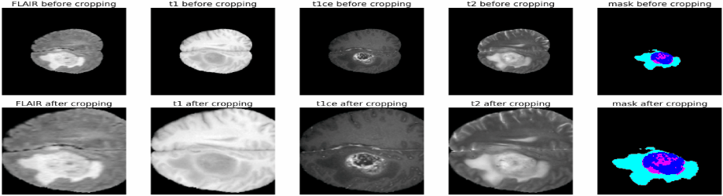

# GSNet: a multi-class 3D attention-based hybrid glioma segmentation network

## Abstract
In modern neuro-oncology, computer-aided biomedical image retrieval (CBIR) tools
have recently gained significant popularity due to their quick and easy usage and high-performance
capability. However, designing such an automated tool remains challenging because of the lack
of balanced resources and inconsistent spatial texture. Like in many other fields of diagnosis,
brain tumor (glioma) extraction has posed a challenge to the research community. In this article,
we proposed a fully developed robust segmentation network called GSNet for the purpose of
glioma segmentation. Unlike conventional 2-dimensional structures, GSNet directly deals with
3-dimensional (3D) data while utilizing attention-based skip links. The network is trained and
validated using the BraTS 2020 dataset and further trained with BraTS 2019 and BraTS 2018
datasets for comparison. While utilizing the BraTS 2020 dataset, our 3D network achieved
an overall dice similarity coefficient of 0.9239, 0.9103, and 0.8139, respectively for whole
tumor, tumor core, and enhancing tumor classes. Our model produces significantly high scores
across all occasions and is capable of dealing with newer data, despite training with imbalanced
datasets. In comparison to other articles, our model outperforms some of the state-of-the-art
scores designating it to be suitable as a reliable CBIR tool for necessary medical usage.

